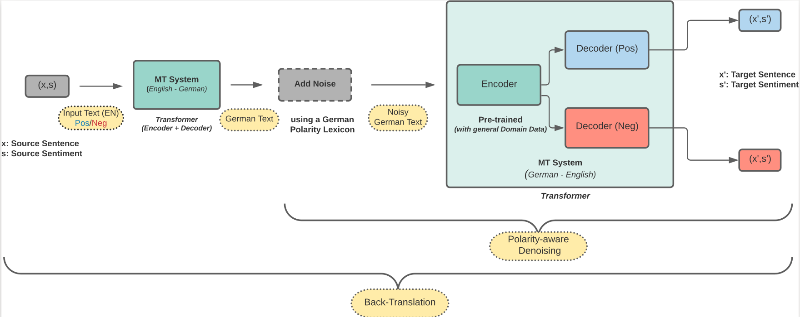

# Sentiment Transfer Using Polarity-Aware Denoising

This repo contains the code and data of the paper: [Balancing the Style-Content Trade-Off in Sentiment Transfer Using Polarity-Aware Denoising](https://link.springer.com/chapter/10.1007/978-3-031-16270-1_15).

## Model Overview

In the pipeline, we (1) translate the source sentence from English to German using a transformer-based machine translation (MT) system; (2) apply noise on the German sentence using a German polarity lexicon; (3) encode the German sentence to latent representation using an encoder of German-to-English translation model; (4) decode the shared latent representation using the decoder for the opposite sentiment.

  

## Model Variants

* 1 [Back-translation](https://github.com/SOURO/polarity-denoising-sentiment-transfer/tree/main/back-translation)
  
  A pure back-translation approach (without any specific provisions for sentiment) is referred to as Back-Translation in our experiments. We use translation into German and subsequent encoding in a back-translation model to get a latent text representation (in our other following model variants) for our sentiment transfer task. We work with English as base language and German as intermediate language. We used the WMT14 English-German (en-de) dataset (1M sentences).

* 2 [Style Tok](https://github.com/SOURO/polarity-denoising-sentiment-transfer/tree/main/style_token)
  
  Is a back-translation model with added sentiment identifiers (<pos> or <neg>) as output starting tokens. At the time of sentiment transfer, we decode the output with a changed sentiment identifier (<pos> → <neg>, <neg> → <pos>).
  
* 3 [Two Sep. transformers](https://github.com/SOURO/polarity-denoising-sentiment-transfer/tree/main/sep_enc_sep_dec)
  
  To get more control over sentiment-specific generation, we train two separate transformer models for positive and negative sentiment, using only sentences of the respective target sentiment. During inference, the model is fed with inputs of the opposite sentiment, which it did not see during training.
  
* 4 [Shrd Enc + Two Sep Decoders](https://github.com/SOURO/polarity-denoising-sentiment-transfer/tree/main/shared_enc_diff_dec)
  We extend the above approach by keeping decoders separate, but using a shared encoder. During training, all examples are passed through the shared encoder, but each decoder is trained to only generate samples of one sentiment. Sentiment transfer is achieved by using the decoder for the opposite sentiment.
  
* 5 [Pre Training Enc](https://github.com/SOURO/polarity-denoising-sentiment-transfer/tree/main/pretrnd_enc)
  
  We introduce a variant where the shared encoder is pretrained for back-translation on general-domain data. The pre-trained encoder is then further fine-tuned during sentiment transfer training.
  
* 6 [Polarity-Aware Denoising](https://github.com/SOURO/polarity-denoising-sentiment-transfer/tree/main/polarity_aware_noising)
  
  The idea of our pre-training scheme—polarity-aware denoising— is to first introduce noise, i.e. delete or mask a certain proportion of words in the intermediate German input to the back-translation step, then train the model to remove this noise, i.e. produce the original English sentence with no words deleted or masked.

## Contributors
If you use this data or code please cite the following:

Sourabrata Mukherjee, Zdenˇek Kasner, and Ondˇrej Dušek. 2022. Balancing the style-content trade-off in sentiment transfer using polarity-aware denoising. In International Conference on Text, Speech, and Dialogue, pages 172–186. Springer.

  @inproceedings{mukherjee2022balancing,
    title={Balancing the Style-Content Trade-Off in Sentiment Transfer Using Polarity-Aware Denoising},
    author={Mukherjee, Sourabrata and Kasner, Zden{\v{e}}k and Du{\v{s}}ek, Ond{\v{r}}ej},
    booktitle={Text, Speech, and Dialogue: 25th International Conference, TSD 2022, Brno, Czech Republic, September 6--9, 2022, Proceedings},
    pages={172--186},
    year={2022},
    organization={Springer}
    }

## Acknowledgements
The code for translation has been mostly borrowed from [here](https://github.com/bentrevett/pytorch-seq2seq/blob/master/6%20-%20Attention%20is%20All%20You%20Need.ipynb).
