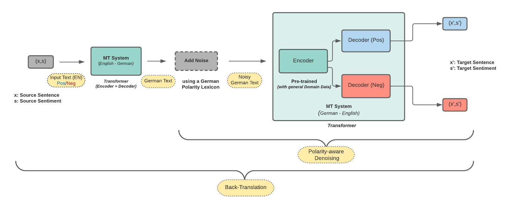

# Sentiment Transfer Using Polarity-Aware Denoising

This repo contains the code and data of the paper: [Balancing the Style-Content Trade-Off in Sentiment Transfer Using Polarity-Aware Denoising](https://link.springer.com/chapter/10.1007/978-3-031-16270-1_15).

## Overview of the Architecture

In the pipeline, we (1) translate the source sentence from English to German using a transformer-based machine translation (MT) system; (2) apply noise on the German sentence using a German polarity lexicon; (3) encode the German sentence to latent representation using an encoder of German-to-English translation model; (4) decode the shared latent representation using the decoder for the opposite sentiment.

  

## Walkthrough

### Dependency
Please do the following:

    pip install -r requirements.txt
    python -m spacy download de_core_news_sm
    python -m spacy download en_core_web_sm

### Model Variants

* [Back-translation](https://github.com/SOURO/polarity-denoising-sentiment-transfer/tree/main/back-translation)

* [Style Tok](https://github.com/SOURO/polarity-denoising-sentiment-transfer/tree/main/style_token)
  
* [Two Sep. transformers](https://github.com/SOURO/polarity-denoising-sentiment-transfer/tree/main/sep_enc_sep_dec)
  
* [Shrd Enc + Two Sep Decoders](https://github.com/SOURO/polarity-denoising-sentiment-transfer/tree/main/shared_enc_diff_dec)
  
* [Pre Training Enc](https://github.com/SOURO/polarity-denoising-sentiment-transfer/tree/main/pretrnd_enc)
  
* [Polarity-Aware Denoising](https://github.com/SOURO/polarity-denoising-sentiment-transfer/tree/main/polarity_aware_noising)

## Contributors
If you use this data or code please cite the following:
  
    @inproceedings{mukherjee2022balancing,
      title={Balancing the Style-Content Trade-Off in Sentiment Transfer Using Polarity-Aware Denoising},
      author={Mukherjee, Sourabrata and Kasner, Zden{\v{e}}k and Du{\v{s}}ek, Ond{\v{r}}ej},
      booktitle={Text, Speech, and Dialogue: 25th International Conference, TSD 2022, Brno, Czech Republic, September 6--9, 2022, Proceedings},
      pages={172--186},
      year={2022},
      organization={Springer}
      }

## License

    Author: Sourabrata Mukherjee
    Copyright © 2023 Sourabrata Mukherjee.
    Licensed under the MIT License ([see here](LICENSE)).

## Acknowledgements

This research was supported by Charles University projects GAUK 392221, GAUK 140320, SVV 260575 and PRIMUS/19/SCI/10, and by the European Research Council (Grant agreement No. 101039303 NG-NLG). It used resources provided by the LINDAT/CLARIAH-CZ Research Infrastructure (Czech Ministry of Education, Youth and Sports project No. LM2018101).

The code for translation has been mostly borrowed from [here](https://github.com/bentrevett/pytorch-seq2seq/blob/master/6%20-%20Attention%20is%20All%20You%20Need.ipynb).

